# Personality Predictor Flow Diagram

## Overview
This diagram explains how the personality predictor determines a user's personality type based on four traits: hair color, beverage preference, vacation spot, and hobby.

## Flow Diagram

```mermaid
graph TD
    A[Start] --> B[Random Trait Selection]
    B --> C[Calculate Personality Points]
    C --> D[Determine Final Personality]
    D --> E[Display Results]

    subgraph "Trait Selection"
        B --> B1[Hair Color]
        B --> B2[Beverage]
        B --> B3[Vacation Spot]
        B --> B4[Hobby]
    end

    subgraph "Point Calculation"
        C --> C1[Hair Color Points]
        C --> C2[Beverage Points]
        C --> C3[Vacation Points]
        C --> C4[Hobby Points]
    end

    subgraph "Personality Types"
        D --> D1[Adventurer]
        D --> D2[Thinker]
        D --> D3[Socialite]
        D --> D4[Creator]
        D --> D5[Nurturer]
        D --> D6[Achiever]
    end

    subgraph "Point Distribution"
        C1 --> |Blonde| D1[+2] & D3[+1]
        C1 --> |Dirty Blonde| D4[+2] & D5[+1]
        C1 --> |Brunette| D2[+2] & D6[+1]

        C2 --> |Energy/Soda| D1[+2] & D3[+1]
        C2 --> |Coffee/Juice| D4[+1] & D6[+2]
        C2 --> |Tea/Water| D2[+2] & D5[+1]

        C3 --> |Beach/City| D1[+1] & D3[+2]
        C3 --> |Countryside/Forest| D4[+2] & D5[+2]
        C3 --> |Mountains/Desert| D2[+1] & D6[+2]

        C4 --> |Sports/Gaming| D1[+2] & D6[+1]
        C4 --> |Music/Art| D3[+1] & D4[+2]
        C4 --> |Reading/Cooking| D2[+2] & D5[+2]
    end

    subgraph "Final Determination"
        D --> |Highest Points| E
    end
```

## Point System Explanation

### Hair Color Points
- Blonde: Adventurer (+2), Socialite (+1)
- Dirty Blonde: Creator (+2), Nurturer (+1)
- Brunette: Thinker (+2), Achiever (+1)

### Beverage Points
- Energy Drink/Soda: Adventurer (+2), Socialite (+1)
- Coffee/Juice: Creator (+1), Achiever (+2)
- Tea/Water: Thinker (+2), Nurturer (+1)

### Vacation Spot Points
- Beach/City: Adventurer (+1), Socialite (+2)
- Countryside/Forest: Creator (+2), Nurturer (+2)
- Mountains/Desert: Thinker (+1), Achiever (+2)

### Hobby Points
- Sports/Gaming: Adventurer (+2), Achiever (+1)
- Music/Art: Socialite (+1), Creator (+2)
- Reading/Cooking: Thinker (+2), Nurturer (+2)

## Personality Type Descriptions

1. **The Adventurer**
   - Bold, spontaneous, ready for new experiences
   - High points from: Blonde hair, Energy drinks, Beach/City, Sports/Gaming

2. **The Thinker**
   - Analytical, thoughtful, introspective
   - High points from: Brunette hair, Tea/Water, Mountains/Desert, Reading/Cooking

3. **The Socialite**
   - Outgoing, charismatic, life of the party
   - High points from: Blonde hair, Energy drinks, Beach/City, Music/Art

4. **The Creator**
   - Imaginative, artistic, unique perspective
   - High points from: Dirty Blonde hair, Coffee/Juice, Countryside/Forest, Music/Art

5. **The Nurturer**
   - Caring, compassionate, empathetic
   - High points from: Dirty Blonde hair, Tea/Water, Countryside/Forest, Reading/Cooking

6. **The Achiever**
   - Ambitious, determined, goal-focused
   - High points from: Brunette hair, Coffee/Juice, Mountains/Desert, Sports/Gaming

## Maximum Points per Personality
- Adventurer: 7 points
- Thinker: 7 points
- Socialite: 6 points
- Creator: 7 points
- Nurturer: 7 points
- Achiever: 7 points

Each personality type can achieve a maximum of 7 points through various trait combinations, ensuring balanced distribution of personality types. 